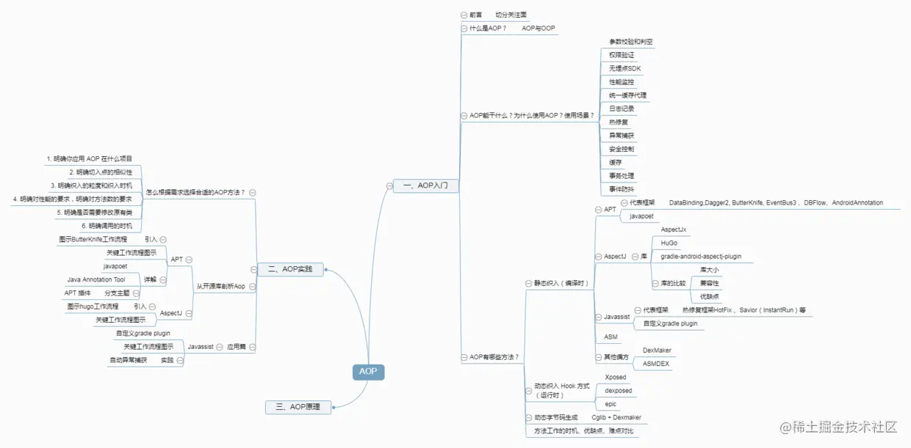
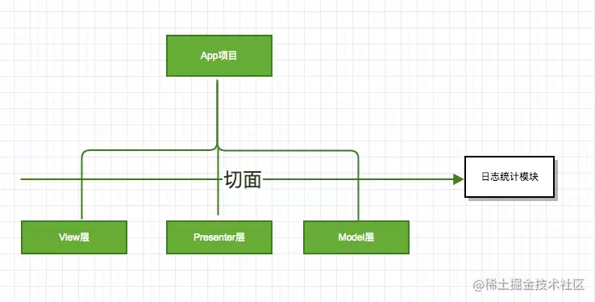

# 一文读懂 AOP | 你想要的最全面 AOP 方法探讨

原文链接：[一文读懂 AOP | 你想要的最全面 AOP 方法探讨 - 掘金 (juejin.cn)](https://juejin.cn/post/6844903728525361165)





相信大家在入门 AOP 时，常常被繁多的术语、方法和框架绕晕。AOP 好像有点耳熟？Javaseopt 是个什么？Javassist 又是啥？Dexposed、APT 也是 AOP？本篇将辅助你快速理清概念，掌握 AOP 思想，找到最适合自己业务场景的 AOP 方法。

## 前言

上文 [也谈代码 —— 重构两年前的代码](https://link.juejin.cn/?target=https%3A%2F%2Fwww.jianshu.com%2Fp%2F0e31122c38f7) 中，我们提到最佳的系统架构由模块化的关注面领域组成，每个关注面均用纯 Java 对象实现。不同的领域之间用最不具有侵害性的「方面」或「类方面」工具整合起来。

反思自己的项目，有很多模块没有做到恰当地切分关注面，往往在业务逻辑中耦合了业务埋点、权限申请、登陆状态的判断、对不可预知异常 try-catch 和一些持久化操作。

虽说保证代码最简单化和可运行化很有必要，但我们还是可以尝试小范围的重构。就如「代码整洁之道」中所说：通过方面式的手段切分关注面的威力不可低估，假如你能用 POJO 编写应用程序的领域逻辑，在代码层面与架构关注面分离开，就有可能真正地用测试来驱动架构。

这里的切分关注面的思想就是 AOP。

------

## 一、AOP即面向切向编程

AOP 是 Aspect Oriented Programming 的缩写，译为面向切向编程。用我们最常用的 OOP 来对比理解：

### 纵向关系 OOP，横向角度 AOP

举个小例子：

设计一个日志打印模块。按 OOP 思想，我们会设计一个打印日志 LogUtils 类，然后在需要打印的地方引用即可。

```typescript
typescript复制代码public class ClassA {
    private void initView() {
        LogUtils.d(TAG, "onInitView");
    }
}

public class ClassB {
    private void onDataComplete(Bean bean) {
        LogUtils.d(TAG, bean.attribute);
    }
}

public class ClassC {
    private void onError() {
        LogUtils.e(TAG, "onError");
    }
}
```

看起来没有任何问题是吧？

但是这个类是横跨并嵌入众多模块里的，在各个模块里分散得很厉害，到处都能见到。从对象组织角度来讲，我们一般采用的分类方法都是使用类似生物学分类的方法，以「继承」关系为主线，我们称之为**纵向**，也就是 OOP。设计时只使用 OOP思想可能会带来两个问题：

1. 对象设计的时候一般都是纵向思维，如果这个时候考虑这些不同类对象的共性，不仅会增加设计的难度和复杂性，还会造成类的接口过多而难以维护（共性越多，意味着接口契约越多）。
2. 需要对现有的对象 **动态增加** 某种行为或责任时非常困难。

而AOP就可以很好地解决以上的问题，怎么做到的？除了这种纵向分类之外，我们从横向的角度去观察这些对象，无需再去到处调用 LogUtils 了，声明哪些地方需要打印日志，这个地方就是一个切面，AOP 会在适当的时机为你把打印语句插进切面。

```typescript
typescript复制代码// 只需要声明哪些方法需要打印 log，打印什么内容
public class ClassA {
    @Log(msg = "onInitView")
    private void initView() {
    }
}

public class ClassB {
    @Log(msg = "bean.attribute")
    private void onDataComplete(Bean bean) {
    }
}

public class ClassC {
    @Log(msg = "onError")
    private void onError() {
    }
}
```

如果说 OOP 是把问题划分到单个模块的话，那么 AOP 就是把涉及到众多模块的某一类问题进行统一管理。AOP的目标是把这些功能集中起来，放到一个统一的地方来控制和管理。利用 AOP 思想，这样对业务逻辑的各个部分进行了隔离，从而降低业务逻辑各部分之间的耦合，提高程序的可重用性，提高开发效率。





### OOP 与 AOP 的区别

1. 面向目标不同：简单来说 OOP 是面向名词领域，AOP 面向动词领域。
2. 思想结构不同：OOP 是纵向结构，AOP 是横向结构。
3. 注重方面不同：OOP 注重业务逻辑单元的划分，AOP 偏重业务处理过程中的某个步骤或阶段。

### OOP 与 AOP 的联系

两者之间是一个相互补充和完善的关系。

------

## 二、应用场景

那AOP既然这么有用，除了上面提到的打印日志场景，还有没有其他用处呢？

当然有！

只要系统的业务模块都需要引用通用模块，就可以使用AOP。以下是一些常用的业务场景：

#### 1. 参数校验和判空

系统之间在进行接口调用时，往往是有入参传递的，入参是接口业务逻辑实现的先决条件，有时入参的缺失或错误会导致业务逻辑的异常，大量的异常捕获无疑增加了接口实现的复杂度，也让代码显得雍肿冗长，因此提前对入参进行验证是有必要的，可以提前处理入参数据的异常，并封装好异常转化成结果对象返回给调用方，也让业务逻辑解耦变得独立。

#### 2. Android API23+的权限控制

避免到处都是申请权限和处理权限的代码

#### 3. 无痕埋点

#### 4. 安全控制

比如全局的登录状态流程控制。

#### 5. 日志记录

#### 6. 事件防抖

防止View被连续点击触发多次事件

#### 7. 性能统计

检测方法耗时其实已经有一些现成的工具，比如 trace view。痛点是这些工具使用起来都比较麻烦，效率低下，而且无法针对某一个块代码或者某个指定的sdk进行查看方法耗时。可以采用 AOP 思想对每个方法做一个切点，在执行之后打印方法耗时。

#### 8. 事务处理

声明方法，为特定方法加上事务，指定情况下（比如抛出异常）回滚事务

#### 9. 异常处理

替代防御性的 try-Catch。

#### 10. 缓存

缓存某方法的返回值，下次执行该方法时，直接从缓存里获取。

#### 11. 软件破解

使用 Hook 修改软件的验证类的判断逻辑。

#### 12. 热修复

AOP 可以让我们在执行一个方法的前插入另一个方法，运用这个思路，我们可以把有 bug 的方法替换成我们下发的新方法。

------

## 三、AOP 方法

> 本篇为入门篇，重在理解 AOP 思想和应用，辅助你快速进行 AOP 方法选型，所以 AOP 方法这块暂不会深入原理和术语。

Android AOP 常用的方法有 JNI HOOK 和 静态织入。

### 动态织入 Hook 方式

在运行期，目标类加载后，为接口动态生成代理类，将切面植入到代理类中。相对于静态AOP更加灵活。但切入的关注点需要实现接口。对系统有一点性能影响。

1. Dexposed
2. Xposed
3. epic
   在 native 层修改 java method 对应的 native 指针

### 动态字节码生成

1. Cglib + Dexmaker

Cglib 是一个强大的,高性能的 Code 生成类库， 原理是在运行期间目标字节码加载后，通过字节码技术为一个类创建子类，并在子类中采用方法拦截的技术拦截所有父类方法的调用，顺势织入横切逻辑。由于是通过子类来代理父类，因此不能代理被 final 字段修饰的方法。

但是 Cglib 有一个很致命的缺点：底层是采用著名的 ASM 字节码生成框架，使用字节码技术生成代理类，也就是通过操作字节码来生成的新的 .class 文件，而我们在 Android 中加载的是优化后的 .dex 文件，也就是说我们需要可以动态生成 .dex 文件代理类，因此 Cglib 不能在 Android 中直接使用。有大神根据 Dexmaker 框架（dex代码生成工具）来仿照 Cglib 库动态生成 .dex 文件，实现了类似于 Cglib 的 AOP 的功能。详细的用法可参考：[将cglib动态代理思想带入Android开发](https://link.juejin.cn/?target=http%3A%2F%2Fblog.csdn.net%2Fzhangke3016%2Farticle%2Fdetails%2F71437287)

### 静态织入方式

- 在编译期织入，切面直接以字节码的形式编译到目标字节码文件中，，这要求使用特殊的 Java 编译器。
- 在类装载期织入，这要求使用特殊的类装载器。

静态织入对系统无性能影响。但灵活性不够。

1. APT
2. AspectJ
3. ASM
4. Javassist
5. DexMaker
6. ASMDEX

这么多方法？有什么区别？

### 方法作用期比对

一图胜千言


AOP 是思想，上面的方法其实都是工具，只不过是插入时机和方式不同。

同：都可以织入逻辑，都体现了 AOP 思想
异：作用的时机不一样，且适用的注解的类型不一样。

### 方法优缺点、难点比对

| 方法          | 作用时机                                | 操作对象                    | 优点                                                         | 缺点                                                         | 为了上手，我需要掌握什么？                                   |
| ------------- | --------------------------------------- | --------------------------- | ------------------------------------------------------------ | ------------------------------------------------------------ | ------------------------------------------------------------ |
| **APT**       | 编译期：还未编译为 class 时             | .java 文件                  | 1. 可以织入所有类；2. 编译期代理，减少运行时消耗             | 1. 需要使用 apt 编译器编译；2. 需要手动拼接代理的代码（可以使用 Javapoet 弥补）；3. 生成大量代理类 | 设计模式和解耦思想的灵活应用                                 |
| **AspectJ**   | 编译期、加载时                          | .java 文件                  | 功能强大，除了 hook 之外，还可以为目标类添加变量，接口。也有抽象，继承等各种更高级的玩法。 | 1. 不够轻量级；2. 定义的切点依赖编程语言，无法兼容Lambda语法；3. 无法织入第三方库；4. 会有一些兼容性问题，如：D8、Gradle 4.x等 | 复杂的语法，但掌握几个简单的，就能实现绝大多数场景           |
| **Javassist** | 编译期：class 还未编译为 dex 时或运行时 | class 字节码                | 1. 减少了生成子类的开销；2. 直接操作修改编译后的字节码，直接绕过了java编译器，所以可以做很多突破限制的事情，例如，跨 dex 引用，解决热修复中 CLASS_ISPREVERIFIED 问题。 | 运行时加入切面逻辑，产生性能开销。                           | 1. 自定义 Gradle 插件；2. 掌握groovy 语言                    |
| **ASM**       | 编译期或运行期字节码注入                | class 字节码                | 小巧轻便、性能好，效率比Javassist高                          | 学习成本高                                                   | 需要熟悉字节码语法，ASM 通过树这种数据结构来表示复杂的字节码结构，并利用 Push 模型来对树进行遍历，在遍历过程中对字节码进行修改。 |
| **ASMDEX**    | 编译期和加载时：转化为 .dex 后          | Dex 字节码，创建 class 文件 | 可以织入所有类                                               | 学习成本高                                                   | 需要对 class 文件比较熟悉，编写过程复杂。                    |
| **DexMaker**  | 同ASMDEX                                | Dex 字节码，创建 dex 文件   | 同ASMDEX                                                     | 同ASMDEX                                                     | 同ASMDEX                                                     |
| **Cglib**     | 运行期生成子类拦截方法                  | 字节码                      | 没有接口也可以织入                                           | 1. 不能代理被final字段修饰的方法；2. 需要和 dexmaker 结合使用 | --                                                           |
| **xposed**    | 运行期hook                              | --                          | 能hook自己应用进程的方法，能hook其他应用的方法，能hook系统的方法 | 依赖三方包的支持，兼容性差，手机需要root                     | --                                                           |
| **dexposed**  | 运行期hook                              | --                          | 只能hook自己应用进程的方法，但无需root                       | 1. 依赖三方包的支持，兼容性差；2. 只能支持 Dalvik 虚拟机     | --                                                           |
| **epic**      | 运行期hook                              | --                          | 支持 Dalvik 和 Art 虚拟机                                    | 只适合在开发调试中使用，碎片化严重有兼容性问题               | --                                                           |

------

## 四、常用的 AOP 方法介绍

业务中常用的 AOP 方式为静态织入，接下来详细介绍静态织入中最常用的三种方式：APT、AspectJ、Javassist。

### 1. APT

APT （Annotation Processing Tool ）即注解处理器，是一种处理注解的工具，确切的说它是 javac 的一个工具，它用来在编译时扫描和处理注解。注解处理器以 Java 代码（ 或者编译过的字节码）作为输入，生成 .java 文件作为输出。简单来说就是在编译期，通过注解生成 .java 文件。使用的 Annotation 类型是 SOURCE。

代表框架：DataBinding、Dagger2、ButterKnife、EventBus3、DBFlow、AndroidAnnotation

##### 为什么这些框架注解实现 AOP 要使用 APT？

目前 Android 注解解析框架主要有两种实现方法，一种是运行期通过反射去解析当前类，注入相应要运行的方法。另一种是在编译期生成类的代理类，在运行期直接调用代理类的代理方法，APT 指的是后者。

如果不使用APT基于注解动态生成 java 代码，那么就需要在运行时使用反射或者动态代理，比如大名鼎鼎的 butterknife 之前就是在运行时反射处理注解，为我们实例化控件并添加事件，然而这种方法很大的一个缺点就是用了反射，导致 app 性能下降。所以后面 butterknife 改为 apt 的方式，可以留意到，butterknife 会在编译期间生成一个 `XXX_ViewBinding.java`。虽然 APT 增加了代码量，但是不再需要用反射，也就无损性能。

##### APT 的缺点改进

性能问题解决了，又带来新的问题了。我们在处理注解或元数据文件的时候，往往有自动生成源代码的需要。难道我们要手动拼接源代码吗？不不不，这不符合代码的优雅，JavaPoet 这个神器就是来解决这个问题的。

##### [JavaPoet](https://link.juejin.cn/?target=https%3A%2F%2Fgithub.com%2Fsquare%2Fjavapoet)

JavaPoet 是 square 推出的开源 java 代码生成框架，提供 Java Api 生成 .java 源文件。这个框架功能非常有用，我们可以很方便的使用它根据注解、数据库模式、协议格式等来对应生成代码。通过这种自动化生成代码的方式，可以让我们用更加简洁优雅的方式要替代繁琐冗杂的重复工作。本质上就是用建造者模式来替代手工拼写源文件。

JavaPoet详细用法可参考：[javapoet——让你从重复无聊的代码中解放出来](https://link.juejin.cn/?target=https%3A%2F%2Fwww.jianshu.com%2Fp%2F95f12f72f69a)

### 2. AspectJ

目前最好、最方便、最火的 AOP 实现方式当属 AspectJ，它是一种几乎和 Java 完全一样的语言，而且完全兼容 Java。

但是在 Android 上集成 AspectJ 是比较复杂的。

我们需要使用 andorid-library gradle 插件在编译时做一些 hook。使用 AspectJ 的编译器（ajc，一个java编译器的扩展）对所有受 aspect 影响的类进行织入。在 gradle 的编译 task 中增加一些额外配置，使之能正确编译运行。等等等等……

有很多库帮助我们完成这些工作，可以方便快捷接入 AspectJ。

#### AspectJ 框架选型

| 库                                                           | 大小  | 兼容性                                         | 缺点                                         | 备注                                           |
| ------------------------------------------------------------ | ----- | ---------------------------------------------- | -------------------------------------------- | ---------------------------------------------- |
| **[Hugo](https://link.juejin.cn/?target=https%3A%2F%2Fgithub.com%2FJakeWharton%2Fhugo)** | 131kb | --                                             | 不支持AAR或JAR切入                           | --                                             |
| **gradle-android-aspectj-plugin**                            | --    | --                                             | 无法兼容databinding，不支持AAR或JAR切入      | 该库已经弃用                                   |
| **[AspectJx](https://link.juejin.cn/?target=https%3A%2F%2Fgithub.com%2FHujiangTechnology%2Fgradle_plugin_android_aspectjx)**（推荐） | 44kb  | 会和有transform功能的插件冲突，如：retroLambda | 在前两者基础上扩展支持AAR, JAR及Kotlin的应用 | 仅支持annotation的方式，不支持 *.aj 文件的编译 |

### 3. Javassist

代表框架：热修复框架HotFix 、Savior（InstantRun）

Javassist 是一个编辑字节码的框架，作用是修改编译后的 class 字节码，ASM也有这个功能，不过 Javassist 的 Java 风格 API 要比 ASM 更容易上手。

既然是修改编译后的 class 字节码，首先我们得知道什么时候编译完成，并且我们要在 .class文件被转为 .dex 文件之前去做修改。在 Gradle Transfrom 这个 api 出来之前，想要监听项目被打包成 .dex 的时机，就必须自定义一个 Gradle Task，插入到 predex 或者 dex 之前，在这个自定义的 Task 中使用 Javassist 或者 ASM 对 class 字节码进行操作。而 Transform 更为方便，我们不再需要插入到某个Task前面。Tranfrom 有自己的执行时机，一经注册便会自动添加到 Task 执行序列中，且正好是 class 被打包成dex之前。

------

## 五、总结

AOP 重在理解这种思想：

1. 先考虑要在什么期间插入代码，选用合适的 AOP 方法；
2. 找准切入点也就是代码可注入的点，比如一个方法的调用处或者方法内部；
3. 接着考虑怎么过滤方法，找到注入点的描述，比如注入到所有onClick方法：call(* view.onClick(..))；
4. 接着要考虑以怎样的方式处理代码，是在代码执行前？执行后？还是包裹代码？还是替换目标代码？