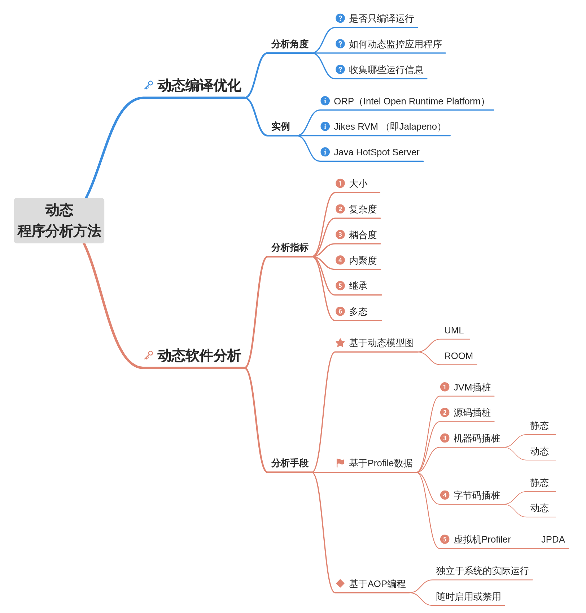

# How

## 一、动态程序分析方法

动态程序分析的应用场景可以大致分为两类：动态编译优化，动态软件分析。根据应用场景的不同，动态程序分析所需要获取的数据、获取数据的方法、分析的流程都有所区别。下面针对这两个场景分别进行分析。

### 动态编译优化

#### 1. 分析角度

为了实现高性能的Java虚拟机和JIT动态编译，需要利用在线收集的程序运行信息实现一个动态编译优化系统，并在编译开销和性能提升之间做出权衡[^1]。

下面分析几个常见的Java动态编译优化系统，它们都使用了某种的自动化、Profile数据驱动的自适应编译优化机制。可以从下面三个角度对这些编译系统进行分析[^2]：

- 该系统是仅使用了编译的方法，还是也使用了一个解释器来允许解释执行和代码编译的混合模式？
- 该系统是如何动态地监控应用程序，从而将某方法的编译优化等级进行提升的？
- 该系统收集了哪些在线运行信息来供更高层优化机制使用？以及是如何收集的？

#### 2. 实例

-  Intel Open Runtime Platform (ORP)[^3]。它只使用了编译的方法，没有解释器。动态编译优化采取了两级模式：一个快速代码生成器，和一个优化编译器。重编译优化的触发有两种方式：

    1. 插入代码来检测计数器的值。当计数器的值到达某个阈值后，代码会在执行线程内跳至重编译例程来进行编译优化。
    2. 使用一个单独的线程来扫描计数器，寻找重编译的候选者，找到后和执行线程并行地进行编译优化。

    这两种方法都要在第一级编译代码的方法入口点和循环后向分支处插入计数器更新指令。这种插桩的缺点在于，虽然插桩代码不是在第二级编译代码中生成的，但它会导致持续的性能开销，除非插桩后的一级编译代码被确定为热点代码从而被重新编译。在那种大多数方法重要性都相近的程序中，这种方式下大多数代码都不会被优化，那么留在一级编译代码中的插桩代码就会严重影响性能。
  
    同时，也因为重编译生成的第二级编译代码不会被插桩，因此想要进一步优化编译后的代码是无法实现的。

- Jikes RVM （也叫Jalapeno）[^4]。它是一个用Java实现的Java虚拟机，只使用了编译的方法，没有解释器。采用多级编译框架，包括一个基础编译器和一个有三个优化等级的优化编译器，相比于非动态适应或单级的编译系统，它在启动阶段和稳定阶段都表现出很好的性能。该系统也使用了更先进的Profile-guided优化方法，使用了插桩采样的框架[^5]。为了采集分析数据，它使用了两种Profiling技术：

  1. 基于计数器的采样机制，用于找到代码中的热点方法。采样profiler在yield point (method prologues and loop back edges) 进行计数，利用了系统的线程准抢占式切换机制。
  2. 更复杂的插桩机制，用于收集热点方法的更多详细信息。

  但是由于采样贯穿于整个程序执行的生命周期，因此会有持续的底线开销。

- Java HotSpot Server[^6]。它使用了自适应的优化系统，并且包含了一个解释器，程序一开始就运行在解释器上。解释器使用了独立的计数器来统计方法调用数和loop back edges。当达到预设的阈值时就会将该方法或循环视为热点。同时，在解释执行的阶段，该系统还会在线收集接收者类型的Profile数据和进行类继承分析（CHA），用于代码优化。由于Profile信息是在早期的解释执行阶段收集的，它们可能并不能代表长期运行的结果，因此容易发生误判。

### 动态软件分析

#### 1. 分析指标

本节涉及的分析指标主要针对软件（特别是面向对象的软件）。动态分析指标和动态分析是紧密关联的，动态分析就是“分析从运行中程序获取的数据”[^7]，而动态分析指标就是被用来测量程序、组件、系统和子系统的运行时性质的，因此采集动态分析指标就是动态分析流程中的一个部分[^8]。

从动态分析中收集的动态分析指标能比静态分析提供对运行时行为更好的描述[^9]。在软件的可维护性预测等领域，动态分析指标也明显优于静态指标[^10]。

根据Anjana Gosain等人在2015年的工作[^11]和Amjed Tahir等人在2012年的工作[^8]，软件的动态分析指标可以被分为一下几类：

- 大小。Dufour等人提出了测量Java程序大小的动态指标[^12]，比如应用中被加载的类数目、某个具体类中被加载的字节码指令数目、被访问到的字节码指令数目、负责了90%程序执行的字节码指令数目。
- 复杂度。Yacoub等人提出运算复杂性来描述软件的动态复杂度[^13]。此外，还有函数复杂度、分数复杂度等动态指标可以用于软件错误和测试有效性的检测[^14]。
- 耦合度。在所有动态指标中，对耦合度的研究是最多的[^11]。
  - Yacoub 等人提出了两种对象级别的动态耦合度指标：Import Object Coupling (IOCx) 和 Export Object Coupling (EOCx)[^13]。
  - Arisholm 等人提出了 12 种动态耦合度指标，根据方向、映射层级和强度的不同进行划分，其中包括 import 或 export 方向的耦合度、对象或类的映射层级、以及消息、方法或类的强度[^15][^16]。
  - Singh等人提出了五种指标：dynamic afferent coupling (DCa)、dynamic key server classes (DKSC)、dynamic key client classes (DKCC)、dynamic key class (DKC) 和 percentage active class (PAC)[^17]。
  - Gupta 和 Chhabra 提出了三种指标：dynamic object coupling (DOC)、total dynamic object coupling (TDOC) 和 class level dynamic coupling (CDC)[^18][^19]。
  - Mitchell 和 Power 提出了Java程序的七种指标，其中包括三种类级别的运行时度量指标和四种对象级别的动态导入和导出耦合度指标[^20][^21]。
  - Yuying 等人提出了四种 fan-in/fan-out 指标作为动态耦合度指标，用于程序理解。其中 Fan-in(s, mi) 表示方法 mi 被其他方法调用的总次数（s代表执行场景），Fan-in(s, Ci) 表示类 Ci 中定义的方法被调用的总次数，Fan-out(s, mi) 和 Fan-out(s, Ci) 则表示相反方向[^22]。
  - Hassoun 等人定义了 Dynamic Coupling Metric (DCM)，通过对程序执行步骤和对象 P 在时间 t 上耦合的总数进行求和得到[^23]。
- 内聚度。该指标用于衡量软件模块或类内部联系的紧密程度。根据文献[^19][^21][^24][^26][^27]，有几个相关的指标被提出：
  1. Runtime Simple LCOM (RLCOM): 是对静态LCOM的扩展，用于度量模块的内聚度。
  2. Runtime Call-Weighted LCOM (RWLCOM): 在运行时根据实例变量的访问次数进行加权计算，用于度量模块的内聚度。
  3. Dynamic cohesion metric DOC: 通过考虑属性的依赖关系、方法的依赖关系以及属性之间的引用依赖，加权求和后除以权重之和来计算动态内聚度。
  4. Dynamic class cohesion (DCC): 是一个类在所有执行场景中创建的所有对象的动态内聚度的平均值。
- 继承。根据Singh等人的工作[^17]，关于继承的动态指标有以下这些：
  - 动态百分比继承耦合度指标（DPIC）：该指标是指所有子类对超类发送的调用数量与运行时直接和间接调用总数之间的百分比。
  - 动态有效子类个数指标（DENOC）：该指标是指在运行时使用方法调用向类C发送的直接继承关系个数与类C的直接继承关系总数之间的百分比。
  - 动态方法继承因子指标（DMIF）：该指标是指在运行时，子类使用的继承方法数量与该类中全部方法数量之间的百分比。它有两个变体，即DMIF1和DMIF2。
- 多态。根据Choi等人[^28]和Dufour[^12]等人的工作，关于多态的指标有多态行为指标、接收者多态指标、接收者多态指标、总调用站点数量指标、调用密度指标等。

#### 2. 分析手段

动态分析使用软件运行时踪迹或系统的动态模型来收集信息[^29]。因此，具体的分析手段可以分为以下几类：

##### 基于动态模型图

该方法基于可执行模块和交互图来模拟运行时行为（比如使用UML、实时面向对象建模ROOM[^31]）。

统一建模语言（UML）提供了描述面向对象系统动态属性的手段，包括状态图、序列图、协作图和活动图等多种不同的图表[^30]。可以根据这些动态 UML 模型定义动态指标。

在设计的早期估算动态指标具有实际意义，因为可以利用这些信息进行早期决策。例如，可以基于UML图表推导测试用例并计算与每个测试用例相关联的动态耦合度，具有高耦合度的测试用例可以先执行，因为预计它们可以发现更多的错误[^15]。

##### 基于Profile数据

Profile是在程序实际运行过程中收集的有关程序运行状态的信息。Profiler（性能分析器）通常用于调查软件系统的性能或内存需求，而Debugger（调试器）通常用于以非常细粒度的方式逐步分析软件系统，以揭示出现意外行为的原因。通常，虚拟机或其他环境的性能分析器和调试器在执行的某些阶段发送事件，然后可以通过VM（虚拟机）或环境的插件捕获这些事件并将其存储在执行踪迹中。使用性能分析器或调试器可以捕获的典型事件包括方法调用、变量访问、方法返回等[^29]。

获取Profile数据的手段可以分为以下几类：

- 对JVM插桩。通过对开源的JVM进行插桩，可以全面地获得Java程序运行各个方面的信息。主要的缺点在于需要开源的JVM代码以及对JVM内核的底层理解[^29]。
- 源码插桩。在源码中插入修改，通常利用一些元编程框架（比如Proteus[^32]，DMS[^33]）。优点是针对性强，缺点是和目标语言紧密相关，处理具体的语言特性时会有问题。
- 机器码插桩。更改或重写已经编译好的机器码。分为两类：
  - 静态：调用库和API，重写二进制码。如ATOM[^34]。
  - 动态：在程序已经被加载进内存后、执行前。如DynInst[^35]。优点是不需要重新编译、链接、运行，更灵活。
- 字节码插桩。对象是已经编译好的字节码，更难实现，但是记录更全面。分为两类：
  - 静态：离线更改编译好的代码，如Javaassist[^36]。无法插桩动态生成和加载的代码。
  - 动态：在程序运行时在线进行插桩，如BIT[^37]。
- 虚拟机Profiler。使用特定虚拟机提供的性能分析工具（尤其是分析memory和heap的使用）。如针对Java SDK的JPDA[^38]，它以接口（JVMTI）的形式提供服务，Profiler插件的开发者只需实现接口即可。在此基础上，可以使用SpecJVM[^39]等Benchmark进行运行时的黑盒测试分析。

##### 基于AOP编程

面向切面编程（AOP）[^40]是一种模块化处理交叉关注点的方法，类似于面向对象编程是一种模块化处理常见关注点的方法。在AOP编程中，无需添加插桩代码，因为编程语言内部提供了内置的构造来实现插桩能力。

AOP引入了这些概念：aspect，join-point，point-cut，advice。因此对程序的profile可以被抽象为一个包含point-cuts和advice的aspect[^41]。目前有针对C++的AspectC++[^42]和针对Java的AspectJ[^43]。

使用AOP获取Profile数据的优势在于，其操作是完全独立于系统的实际运行的。因此，追踪能够在不对系统的基本功能产生任何副作用的情况下进行，并且能够根据需要随时启用或禁用该功能[^29]。

因为AOP编程拥有的诸多优点，它正越来越受到重视，也有框架来辅助进行AOP编程[^44][^45]。

## 参考文献

[^1]: Ball, T. (1999). The concept of dynamic analysis. *ACM SIGSOFT Software Engineering Notes*, *24*(6), 216-234.
[^2]: Suganuma, T., Yasue, T., Kawahito, M., Komatsu, H., & Nakatani, T. (2005). Design and evaluation of dynamic optimizations for a Java just-in-time compiler. *ACM Transactions on Programming Languages and Systems (TOPLAS)*, *27*(4), 732-785.
[^3]: Cierniak, M., Eng, M., Glew, N., Lewis, B., & Stichnoth, J. (2005). The Open Runtime Platform: a flexible high‐performance managed runtime environment. *Concurrency and Computation: Practice and Experience*, *17*(5‐6), 617-637.
[^4]: Burke, M. G., Choi, J. D., Fink, S., Grove, D., Hind, M., Sarkar, V., ... & Whaley, J. (1999, June). The Jalapeno dynamic optimizing compiler for Java. In *Proceedings of the ACM 1999 conference on Java Grande* (pp. 129-141).
[^5]: Arnold, M., & Ryder, B. G. (2001, May). A framework for reducing the cost of instrumented code. In *Proceedings of the ACM SIGPLAN 2001 conference on Programming language design and implementation* (pp. 168-179).
[^6]: Paleczny, M., Vick, C., & Click, C. (2001). The java {HotSpot™} server compiler. In *Java (TM) Virtual Machine Research and Technology Symposium (JVM 01)*.
[^7]: Cornelissen, B., Zaidman, A., Van Deursen, A., Moonen, L., & Koschke, R. (2009). A systematic survey of program comprehension through dynamic analysis. *IEEE Transactions on Software Engineering*, *35*(5), 684-702.
[^8]: Tahir, A., & MacDonell, S. G. (2012, September). A systematic mapping study on dynamic metrics and software quality. In *2012 28th IEEE International Conference on Software Maintenance (ICSM)* (pp. 326-335). IEEE.
[^9]: Richner, T., & Ducasse, S. (1999, August). Recovering high-level views of object-oriented applications from static and dynamic information. In *Proceedings IEEE International Conference on Software Maintenance-1999 (ICSM'99).'Software Maintenance for Business Change'(Cat. No. 99CB36360)* (pp. 13-22). IEEE.
[^10]: Sharma, H., & Chug, A. (2015, September). Dynamic metrics are superior than static metrics in maintainability prediction: An empirical case study. In *2015 4th International Conference on Reliability, Infocom Technologies and Optimization (ICRITO)(Trends and Future Directions)* (pp. 1-6). IEEE.
[^11]: Gosain, A., & Sharma, G. (2015). Dynamic software metrics for object oriented software: a review. In *Information Systems Design and Intelligent Applications: Proceedings of Second International Conference INDIA 2015, Volume 2* (pp. 579-589). Springer India.
[^12]: Dufour, B., Driesen, K., Hendren, L., & Verbrugge, C. (2003, October). Dynamic metrics for Java. In *Proceedings of the 18th annual ACM SIGPLAN conference on Object-oriented programing, systems, languages, and applications* (pp. 149-168).
[^13]: Yacoub, S. M., Ammar, H. H., & Robinson, T. (1999, November). Dynamic metrics for object oriented designs. In *Proceedings Sixth International Software Metrics Symposium (Cat. No. PR00403)* (pp. 50-61). IEEE.
[^14]: Munson, J. C., & Hall, G. A. (1996). Estimating test effectiveness with dynamic complexity measurement. *Empirical Software Engineering*, *1*, 279-305.
[^15]: Arisholm, E., Briand, L. C., & Foyen, A. (2004). Dynamic coupling measurement for object-oriented software. *IEEE Transactions on software engineering*, *30*(8), 491-506.
[^16]: Arisholm, E., Sjøberg, D. I., & Jørgensen, M. (2001). Assessing the changeability of two object-oriented design alternatives--A controlled experiment. *Empirical Software Engineering*, *6*, 231-277.
[^17]: Singh, P. (2009). *Design and validation of dynamic metrics for object-oriented software systems* (Doctoral dissertation, PhD Thesis), Guru Nanak Dev University, Amritsar, India).
[^18]: Gupta, V. (2011). Validation of dynamic coupling metrics for object-oriented software. *ACM SIGSOFT Software Engineering Notes*, *36*(5), 1-3.
[^19]: Gupta, V. (2018). Object-Oriented Static and Dynamic Software Metrics for Design and Complexity.
[^20]: Mitchell, A., & Power, J. F. (2004). An empirical investigation into the dimensions of run-time coupling in Java programs.
[^21]: Mitchell, A., & Power, J. F. (2005, March). Using object-level run-time metrics to study coupling between objects. In *Proceedings of the 2005 ACM symposium on Applied computing* (pp. 1456-1462).
[^22]: Wang, Y. Y., Li, Q. S., Chen, P., & Ren, C. D. (2007). Dynamic fan-in and fan-out metrics for program comprehension. *Journal of Shanghai University (English Edition)*, *11*(5), 474-479.
[^23]: Hassoun, Y., Johnson, R., & Counsell, S. (2004, March). A dynamic runtime coupling metric for meta-level architectures. In *Eighth European Conference on Software Maintenance and Reengineering, 2004. CSMR 2004. Proceedings.* (pp. 339-346). IEEE.
[^24]: Mitchell, A., & Power, J. F. (2003). *Run-time cohesion metrics for the analysis of Java programs*. Technical Report, Series No. NUIM-CS-TR-2003-08, National University of Ireland, Maynooth, Co. Kildare, Ireland.
[^26]: Chidamber, S. R., & Kemerer, C. F. (1994). A metrics suite for object oriented design. *IEEE Transactions on software engineering*, *20*(6), 476-493.
[^27]: Gupta, V., & Chhabra, J. K. (2011). Dynamic cohesion measures for object-oriented software. *Journal of Systems Architecture*, *57*(4), 452-462.
[^28]: Choi, K. H., & Tempero, E. (2007, January). Dynamic measurement of polymorphism. In *Proceedings of the thirtieth Australasian conference on Computer science-Volume 62* (pp. 211-220).
[^29]: Gupta, V., & Chhabra, J. K. (2008, May). Measurement of dynamic metrics using dynamic analysis of programs. In *Proceedings of the WSEAS International Conference on Applied Computing Conference* (pp. 81-86).
[^30]: *What is UML.* Retrieved July, 2023, from [What is UML | Unified Modeling Language](https://www.uml.org/what-is-uml.htm)
[^31]: Selic, B. (1996). Real-time object-oriented modeling. *IFAC Proceedings Volumes*, *29*(5), 1-6.
[^32]: Waddington, D. G., & Yao, B. (2005). High-fidelity C/C++ code transformation. *Electronic Notes in Theoretical Computer Science*, *141*(4), 35-56.
[^33]: Baxter, I. D. (2002, May). DMS: Program transformations for practical scalable software evolution. In *Proceedings of the International Workshop on Principles of Software Evolution* (pp. 48-51).
[^34]: Buck, B., & Hollingsworth, J. K. (2000). An API for runtime code patching. *The International Journal of High Performance Computing Applications*, *14*(4), 317-329.
[^35]: Srivastava, A., & Eustace, A. (1994, June). ATOM: A system for building customized program analysis tools. In *Proceedings of the ACM SIGPLAN 1994 conference on Programming language design and implementation* (pp. 196-205).
[^36]: Chiba, S. (2000, May). Load-time structural reflection in Java. In *European Conference on Object-Oriented Programming* (pp. 313-336). Berlin, Heidelberg: Springer Berlin Heidelberg.
[^37]: Lee, H. B., & Zorn, B. G. (1997). {BIT}: A Tool for Instrumenting Java Bytecodes. In *USENIX Symposium on Internet Technologies and Systems (USITS 97)*.
[^38]: *Java Platform Debugger Architecture.* Retrieved July, 2023, from [Java Platform Debugger Architecture (JPDA) (oracle.com)](https://docs.oracle.com/javase/8/docs/technotes/guides/jpda/index.html)
[^39]: *SpecJVM 2008.* Retrieved July, 2023, from [SPECjvm2008](https://www.spec.org/jvm2008/)
[^40]: Kiczales, G., Lamping, J., Mendhekar, A., Maeda, C., Lopes, C., Loingtier, J. M., & Irwin, J. (1997). Aspect-oriented programming. In *ECOOP'97—Object-Oriented Programming: 11th European Conference Jyväskylä, Finland, June 9–13, 1997 Proceedings 11* (pp. 220-242). Springer Berlin Heidelberg.
[^41]: Gosain, A., & Sharma, G. (2015). A survey of dynamic program analysis techniques and tools. In *Proceedings of the 3rd International Conference on Frontiers of Intelligent Computing: Theory and Applications (FICTA) 2014: Volume 1* (pp. 113-122). Springer International Publishing.
[^42]: Spinczyk, O., Lohmann, D., & Urban, M. (2005). AspectC++: an AOP Extension for C++. *Software Developer’s Journal*, *5*(68-76).
[^43]: Kiczales, G., Hilsdale, E., Hugunin, J., Kersten, M., Palm, J., & Griswold, W. G. (2001). An overview of AspectJ. In *ECOOP 2001—Object-Oriented Programming: 15th European Conference Budapest, Hungary, June 18–22, 2001 Proceedings 15* (pp. 327-354). Springer Berlin Heidelberg.
[^44]: Villazón, A., Binder, W., Ansaloni, D., & Moret, P. (2009, October). Hotwave: creating adaptive tools with dynamic aspect-oriented programming in java. In *Proceedings of the eighth international conference on Generative programming and component engineering* (pp. 95-98).
[^45]: Chatterjee, N., Bose, S., & Das, P. P. (2017, March). Dynamic weaving of aspects in C/C++ using PIN. In *Proceedings of the International Conference on High Performance Compilation, Computing and Communications* (pp. 55-59).
