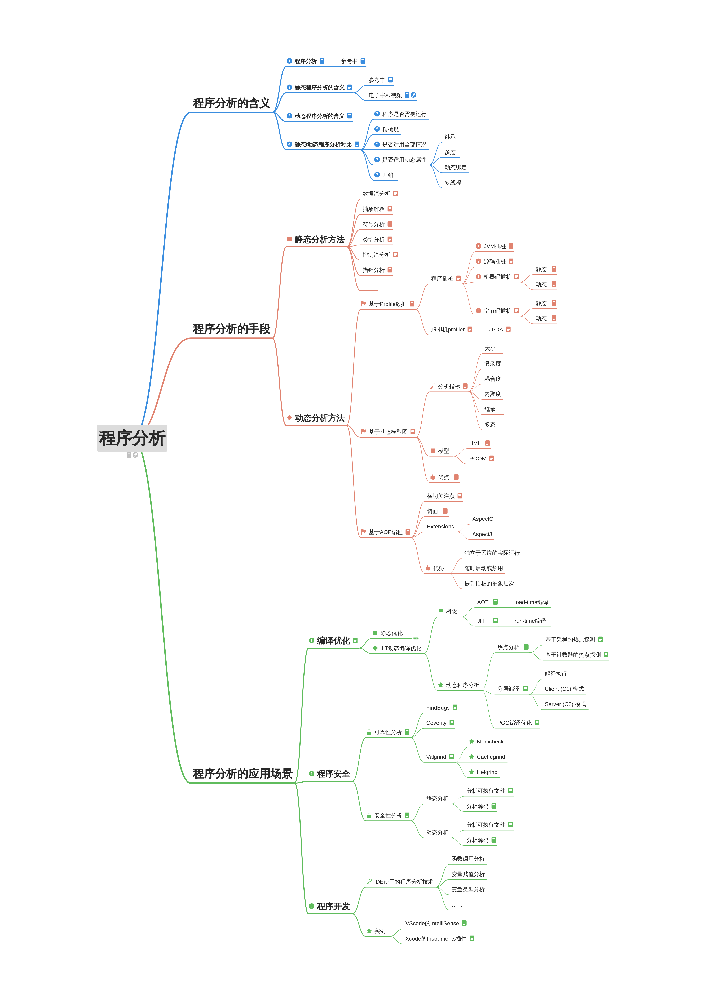

# 程序分析

思维导图在线查看：https://zhimap.com/m/lNRSaJNX

文件说明：

- What.md：程序分析的含义。
- Why.md：静态和动态程序分析的实例和局限。
- How.md：程序分析方法。
- Tools.md：动态程序分析工具。
- BinaryAnalysis.md：针对二进制可执行文件进行分析的方法。

其它：

- Literature.md：文献阅读笔记。
- Outline.md：初版大纲。
- pics：markdown附件资源。

