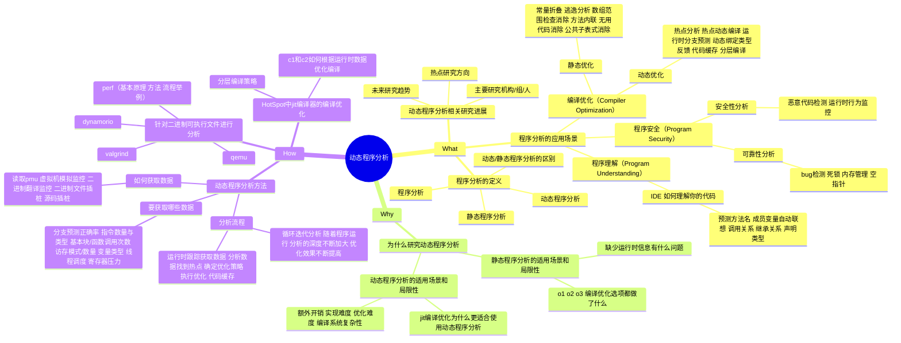

```mermaid
mindmap
  root((动态程序分析))
    What
      程序分析的定义
        程序分析
        静态程序分析
        动态程序分析
        动态/静态程序分析的区别
      程序分析的应用场景
        编译优化（Compiler Optimization）
          静态优化
            常量折叠 逃逸分析 数组范围检查消除 方法内联 无用代码消除 公共子表式消除
          动态优化
            热点分析 热点动态编译 运行时分支预测 动态绑定类型反馈 代码缓存 分层编译
        程序安全（Program Security）
          可靠性分析
            bug检测 死锁 内存管理 空指针
          安全性分析
            恶意代码检测 运行时行为监控
        程序理解（Program Understanding）
          IDE 如何理解你的代码
            预测方法名 成员变量自动联想 调用关系 继承关系 声明类型
      动态程序分析相关研究进展
        主要研究机构/组/人
        热点研究方向
        未来研究趋势
    Why
      为什么研究动态程序分析
        静态程序分析的适用场景和局限性
          o1 o2 o3 编译优化选项都做了什么
          缺少运行时信息有什么问题
        动态程序分析的适用场景和局限性
          jit编译优化为什么更适合使用动态程序分析
          额外开销 实现难度 优化难度 编译系统复杂性
    How
      动态程序分析方法
        分析流程
          循环迭代分析 随着程序运行 分析的深度不断加大 优化效果不断提高
          运行时跟踪获取数据 分析数据找到热点 确定优化策略 执行优化 代码缓存
        要获取哪些数据
          分支预测正确率 指令数量与类型 基本块/函数调用次数 访存模式/数量 变量类型 线程调度 寄存器压力
        如何获取数据
          读取pmu 虚拟机模拟监控 二进制翻译监控 二进制文件插桩 源码插桩
      针对二进制可执行文件进行分析
          perf（基本原理 方法 流程举例）
          qemu
          dynamorio
          valgrind
      HotSpot中jit编译器的编译优化
          分层编译策略
          c1和c2如何根据运行时数据优化编译
```

# 文献阅读
