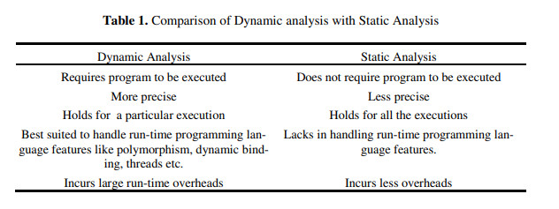

# What
[TOC]

## 一、程序分析的定义

### 1. 程序分析

程序分析是指自动分析一个程序的包括正确性、安全性和性能等特征的过程[^1]。可以用于编译优化、提供告警信息等。

### 2. 静态程序分析

静态程序分析是指不必运行程序就能对程序进行的分析[^2]。

它的一些应用场景如下[^3]：

- 程序优化。要想优化编译器，就需要分析被编译的程序的诸多性质（如是否存在dead code，某变量的值是否依赖输入等）。
- 程序正确性分析。程序测试只能说明程序存在bug，但正确性分析要求证明bug不存在，这要求对程序的诸多性质进行分析（如数据是否始终不越界、是否会抛出异常、并发情况下是否有数据竞争等）。
- 程序开发。现代IDE使用静态程序分析来支持代码调试、代码重构、代码理解，辅助代码开发。

静态分析方法包括但不限于：数据流分析、抽象解释、符号分析、类型分析、控制流分析、指针分析等[^2][^3]。

### 3. 动态程序分析

动态程序分析是指分析运行中程序的性质[^4]。它使用程序在运行时或运行后获取的信息，对程序的性质进行分析，分为online和offline：online是指在程序运行过程中分析程序行为，offline是指记录程序运行行为，在运行结束后再进行分析[^5]。

动态程序分析的技术可以分为三类[^6]：

- 程序插桩。包括修改源码、修改机器码、修改字节码。后两者根据是否在运行时插桩，都可以分为静态和动态两种。
- 虚拟机profiling。使用特定虚拟机提供的Profiling工具。如针对Java SDK的JPDA。它们以接口（如JPDA的JVMTI）的形式提供服务，Profiler插件的开发者只需实现接口即可。
- AOP。使用面向切面编程，从编程语言的高级层次，对程序的profiling可以被抽象为一个包含point-cuts和advice的aspect。

### 4. 动态/静态程序分析的区别

两者的区别见表1[^6]：

表1 动态和静态程序分析对比

关于精度问题，由于静态分析往往只能对性质做出估计，并且有可能考虑了许多实际运行中根本不会发生的路径，因此可能出现太多false positive，而动态分析因为针对具体运行，因此不会出现这个问题，但随之而来的缺陷就是结论无法覆盖所有执行情况。

此外，动态分析的范围更大，能检测程序执行路径中相距很远的两者之间的语义关系，但是静态分析通常局限于较小的范围内[^4]。

---

##  二、程序分析的应用场景

### 1. 编译优化

#### 静态优化

编译静态优化和程序分析的关系在于：在编译器能够改进代码之前，它必须在程序中找到更改后可以提升运行性能的点，并且编译器必须证明在这些点更改代码是安全的。这两项任务都需要更深入地理解代码。为了定位程序中的优化点并证明这些优化的合理性，编译器会使用某种形式的静态分析[^7]。

在编译优化的不同阶段，程序分析都发挥重要作用[^8]：比如，在编译早期阶段的优化方法中，常量折叠、标量替代、代数化简与重关联需要对程序进行分析，数值编号、复制传递、稀疏条件常数传播等需要依赖数据流分析来保证有效性和正确性。之后，在进行冗余消除的过程中，公共子表达式消除、循环不变代码外提、死码消除等也需要数据流分析[^9]。

#### 动态优化

由于动态语言（如java）在执行时进行及时编译，因此JIT编译器可以使用运行过程中收集的profile信息进行动态编译优化[^10]。

比如，在代码运行的过程中根据代码被调用执行的频率收集代码运行的“热点”，然后针对这些热点进行编译优化，提升整体性能[^11]。

动态分支预测需要通过动态收集和分析分支指令的执行历史、监测每个分支指令的执行结果，预测分支是被正确预测还是错误预测[^12]。这种程序分析技术涉及到对程序执行过程的实时追踪和记录，以便构建预测模型并根据历史执行结果进行准确的预测。

再比如，分层编译也利用运行时信息。它分为多个编译层次，每个层次都具有不同的编译策略和优化程度。在开始阶段，程序会经过解释执行或者轻量级编译（例如 JIT 编译）来尽快启动。随着程序的运行，一旦检测到某些代码被频繁执行，它会将这些代码升级到更高层次的编译阶段，优化技术会更加充分地使用[^13]。

相比于静态优化，动态优化利用了程序运行时的反馈信息，有如下优势[^14]：

- 突破了静态优化无法推测动态运行信息的限制。
- 当条件变化时可以随时调整、恢复策略。
- 运行时动态绑定使得软件系统更加灵活可变。

### 2. 程序安全

#### 可靠性分析

程序分析可以帮助检测并修复代码中的各种类型的bug，例如缓冲区溢出、整数溢出、资源泄漏等。

2004年的高引研究FindBugs就将程序bug提取为若干pattern（如返回值未检查、空指针解引用等等），然后用静态程序分析的办法（控制流分析、数据流分析等）对bug进行检测[^15]。

Coverity作为一款静态分析工具，可以检测C、C++、Java等编程语言中的各种类型的bug。它使用了多种静态分析技术，包括数据流分析和符号执行，以发现潜在的缓冲区溢出、空指针解引用、资源泄漏等问题[^16]。

Valgrind是一套广泛使用的动态程序分析工具，用于检测内存错误、线程问题、性能问题等。它提供了多个工具，包括Memcheck（检测内存错误，如使用未初始化的内存、读写已释放的内存、内存泄漏等）、Helgrind（检测多线程程序中的竞争条件和死锁问题）、Cachegrind（它对CPU中的I1、D1和L2缓存执行详细的模拟，因此可以准确地确定代码中缓存未命中的来源）等[^17]。

#### 安全性分析

静态分析和动态分析或者两者的混合运用都可以用于恶意软件检测[^18]。

静态分析可以分为对可执行文件的分析和对代码的分析。

- 在不运行可执行二进制文件的情况下对其进行分析，往往依靠提取和识别过往恶意程序数据库中的pattern来获取可疑二进制文件相关的元数据。因此，恶意软件可以通过混淆、插入死码、压缩等方式绕过静态二进制文件分析[^19]。
- 对代码的分析，首先要对程序进行反汇编获取源代码，然后分析其中可能被恶意利用的漏洞[^18]。

动态分析也可以分为对可执行文件的分析和对代码的分析。

- 对二进制可执行文件，可以将它隔离在安全的环境中运行，然后使用自动工具检测它的行为。虽然二进制可执行文件的代码和结构会频繁变化，但恶意软件的行为却往往相似，因此大部分恶意软件家族可以用动态程序分析的方式进行检测[^20]。
- 对源代码的动态分析，需要针对不同的输入执行代码，在真实或虚拟的环境中对程序运行过程进行检测[^18]。

### 3. 程序理解

IDE使用多种程序分析技术来支持调试、代码重构、程序理解，静态程序分析能帮助解决这些问题，比如[^3]：

- 在某行哪些函数可能被调用，或者某函数可能在哪些地方被调用？函数内联和其他类型的代码重构需要依赖这些信息。
- 在程序的哪些地方变量x可能被赋值？变量x的值是否可能影响变量y的值？
- 变量x可能有哪些类型的值？对于一些弱类型语言这个问题尤其重要。

现代IDE中的应用实例有：

- VScode的IntelliSense可以提供代码补全、智能提醒和自动修复等功能。它通过分析源代码的结构、上下文和语义，提供准确的代码建议和错误检查[^21]。

- Xcode的Instruments插件可以对程序进行动态分析。它是一个集成在IDE内的强大而灵活的性能分析和测试工具，可以使用插桩来生成profile，检测内存泄漏和性能问题[^22]。

## 三、动态程序分析相关研究

---

## 参考文献

[^1]: Nielson, F., Nielson, H. R., & Hankin, C. (2015). Principles of program analysis. Springer.
[^2]: Wögerer, W. (2005). *A survey of static program analysis techniques*. Tech. rep., Technische Universität Wien.
[^3]: Møller, A., & Schwartzbach, M. I. (2012). Static program analysis. *Notes. Feb*.
[^4]: Ball, T. (1999). The concept of dynamic analysis. *ACM SIGSOFT Software Engineering Notes*, *24*(6), 216-234.
[^5]: Jackson, D., & Rinard, M. (2000, May). Software analysis: A roadmap. In *Proceedings of the Conference on the Future of Software Engineering* (pp. 133-145).
[^6]: Gosain, A., & Sharma, G. (2015). A survey of dynamic program analysis techniques and tools. In *Proceedings of the 3rd International Conference on Frontiers of Intelligent Computing: Theory and Applications (FICTA) 2014: Volume 1* (pp. 113-122). Springer International Publishing.
[^7]: Cooper, K. D., & Torczon, L. (2011). *Engineering a compiler*. Elsevier.
[^8]: Muchnick, S. (1997). *Advanced compiler design implementation*. Morgan kaufmann.
[^9]: Kennedy, K. (1979). *A survey of data flow analysis techniques*. IBM Thomas J. Watson Research Division.
[^10]: Suganuma, T., Yasue, T., Kawahito, M., Komatsu, H., & Nakatani, T. (2001). A dynamic optimization framework for a Java just-in-time compiler. *ACM SIGPLAN Notices*, *36*(11), 180-195.
[^11]: Paleczny, M., Vick, C., & Click, C. (2001, April). The java hotspottm server compiler. In *Proceedings of the Java Virtual Machine Research and Technology Symposium* (Vol. 1, pp. 1-12).
[^12]: Mittal, S. (2019). A survey of techniques for dynamic branch prediction. *Concurrency and Computation: Practice and Experience*, *31*(1), e4666.
[^13]: Jantz, M. R., & Kulkarni, P. A. (2013). Exploring single and multilevel JIT compilation policy for modern machines. *ACM Transactions on Architecture and Code Optimization (TACO)*, *10*(4), 1-29.
[^14]: Smith, M. D. (2000, January). Overcoming the challenges to feedback-directed optimization (keynote talk). In *Proceedings of the ACM SIGPLAN workshop on Dynamic and adaptive compilation and optimization* (pp. 1-11).
[^15]: Hovemeyer, D., & Pugh, W. (2004). Finding bugs is easy. *Acm sigplan notices*, *39*(12), 92-106.
[^16]: *Coverity static analysis data sheet.* Retrieved June, 2023, from https://www.synopsys.com/content/dam/synopsys/sig-assets/datasheets/SAST-Coverity-datasheet.pdf
[^17]: *Valgrind's tool suite.* Retrieved June, 2023, from https://valgrind.org/info/tools.html
[^18]: Maniriho, P., Mahmood, A. N., & Chowdhury, M. J. M. (2022). A study on malicious software behaviour analysis and detection techniques: Taxonomy, current trends and challenges. *Future Generation Computer Systems*, *130*, 1-18.
[^19]: Yücel, Ç., & Koltuksuz, A. (2020). Imaging and evaluating the memory access for malware. *Forensic Science International: Digital Investigation*, *32*, 200903.
[^20]: Aslan, Ö. A., & Samet, R. (2020). A comprehensive review on malware detection approaches. *IEEE Access*, *8*, 6249-6271.
[^21]: *IntelliSense in VS code.* Retrieved June, 2023, from https://code.visualstudio.com/docs/editor/intellisense#_intellisense-for-your-programming-language
[^22]: *Instruments for Xcode.* Retrieved June, 2023,  from https://help.apple.com/instruments/mac/current/#/dev7b09c84f5
